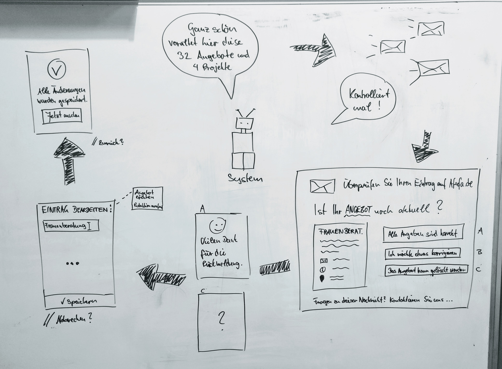
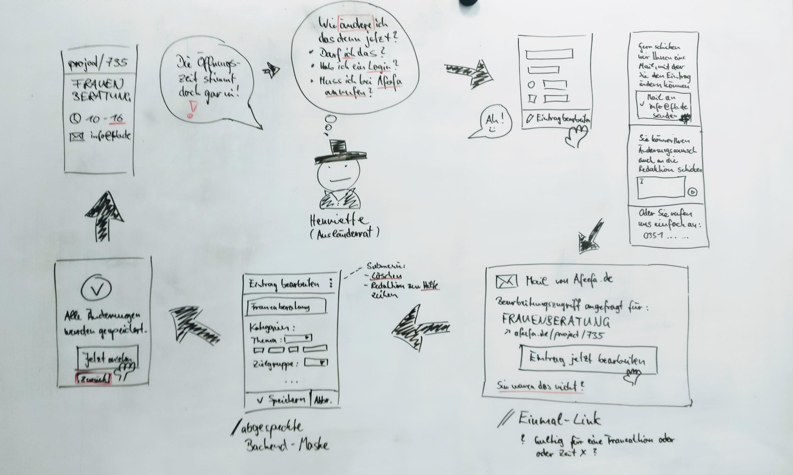
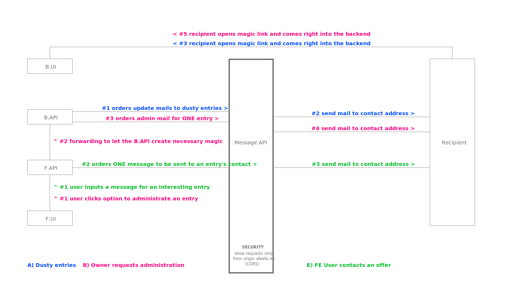

# afeefa-messaging
Service in the afeefa universe which is responsible for everything that is sending and receiving messages like mails or push notifications etc.

## Responsibilites

### A) Dusty entries need to be verified by owners > send update requests
[triggered by cronjob]
- periodically ask owners to verify the data of their entries (projects, events etc.)
- owners receive an email, that offers them an easy way to check their data
    - entry data is ok > nothing to do
    - entry data is invalid > need to update
    - entry is obsolete > please delete

### B) Owner likes to administrate an entry > send admin link
[triggered by user]
- at the request of an user (propably the owner) to edit an entry in the afeefa database, an email is send to the entry's owner
- the email offers an easy way to update the data
    - entry data is invalid > need to update
    - entry is obsolete > please delete
- - use magic edit links? life time lasts for one interaction or for a certain time X?

### C) Redaktion gets informed of a new entry submission > send info messages
[triggered by user]
- after a frontend user has filled out the form for adding something to the afeefa database, the editorial team gets informed
- the recipients of the info message depend on the **area**, which the frontend user acts in
- messages can serve **multiple channels**: mail, slack

### D) Redaktion likes to contact a person from within the backend
[triggerd by user]
- backend user can send a message to some person via mail (if available)
- the user can choose between **message templates** for various purposes:
    - publication info
    - custom message
- information about the backend user is automatically included in the signature
- the recipient has a **comfortable way to answer** and the answer is **efficiently delivered to the sender**

**Questions to answer:**
- who serves the message templates? it might be nice for the BUI to fetch them from the message API instead of knowing them itself
- can recipients answer in a way that their message is delivered right back into the backend? (instead of additional mails in the inbox)

### E) Frontend user contacts an entry via the provided message form

### F) Frontend user gives feedback to afeefa

## Implementation

### Magic links
- each time an admin mail is sent out, the backend.api creates a new backend user (cryptic), that just behaves like a normal backend user with a specific role (e.g. role = ORGAADMIN) and access to the necessary data records
- this user is associated with a magic link, which contains information to authenticate and login that user (might simply be the cryptic user name + password)
- the link calls an extra B.API endpoint (or even the B.UI's /login route), that automatically reads the GET parameters, creates a user session and redirects to the right backend view to edit the requested entry

### Typical tasks to handle

**Routing** > `Router`

**Authenticate request** > `Router`
- check request origin (CORS)
- limit similar requests to a maximum per time or sth.
- further more require a secret key

**Building the message** > `MessageBuilder`
- combine incoming dynamic data with message templates
- create a readable message for each communication platform to serve, e.g. responsive mails for various clients in HTML and plain text

**Sending the message** > `Messenger`
- e.g. use SMTP mailer for mails

**Receiving answer from the recipient** > `Reception`
- handle link openings, analyse and may forward to the right service or sth.
- handle text messages

**Logging** > `Logger`
- what was sent and why
    - mail type, e.g. "publication info"
    - data context, e.g. ID of the published entry, backend user who invoked the mail etc.
    - delivery status
- recipient activity:
    - interaction, e.g. mail opened, links clicked etc.

## Routes
see index route `/` which renders a tiny API doc

## Dependencies to other services
- needs information from `afeefa-backend-api` about outdated entries to send the emails
- needs end points for entry editing, which are handed out to the users (data ok, data update, data delete ...)

## Development
1. checkout repo in a desired place
2. Install all dependencies via `$ composer install` AND `$ npm install`
3. create config files `/config/smtpconf.ini` and `/config/auth.ini` and `/config/template_vars.php` from provided example files
1. create `.htaccess` file from provided example file
1. serve `/dist` folder with php like `$ php -S localhost:3010 -t dist/`
2. `$ npm run dev` to watch and build all mail templates
1. fire requests to the routes, e.g. using postman

**render a specific mail template without watching**  
`$ ./node_modules/.bin/mjml mail_templates/name.mjml --output mail_templates_built/name.html`

**create a new mail template**
1. create new route in `Router.php`
    - the method `build('[template-key]', $json);` needs a custom string value for naming the template
    - following the convention, other things refer to this *template key*
1. create a mjml template file in `/templates/mail`
    - file name must be `[template-key].mjml`
    - style it and use data placeholders if needed
1. provide necessary data in `/config/template_vars.php` like the mail's *subject* or *reply-to-address*
1. [would be nice] document it in `dist/view/index.html`

## Deployment
1. checkout repo in a temporary location
2. Install all dependencies via `$ composer install`
3. copy the folder `/dist` to the final location and continue there
3. create config files `/config/smtpconf.ini` and `/config/auth.ini` and `/config/template_vars.php` from provided example files
4. create `.htaccess` file from provided example file

